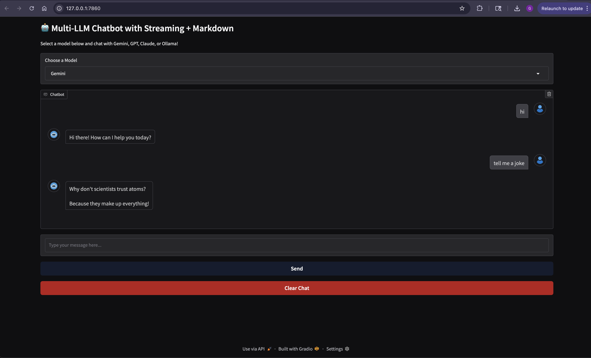

# 🤖 Simple + Multi-LLM Chatbot with Streaming

A simple web-based chatbot interface built with [Gradio](https://gradio.app) that supports multiple large language models (LLMs):

- 🧠 OpenAI (GPT-4o-mini)
- 🌈 Google Gemini (gemini-2.5-flash)
- 🧠 Anthropic Claude (claude-3-opus-20240229)
- 🐘 Ollama (llama-3.2)

Supports:

- ✅ Model selection via dropdown
- ✅ Real-time **streaming responses**
- ✅ **Markdown**-rendered outputs
- ✅ Full message history for context

---

## 🚀 Features

- **Model Switching**: Choose which LLM to use dynamically.
- **Streaming**: Messages appear as they're generated.
- **Markdown**: Supports links, bold, italics, code blocks, etc.
- **Simple UI**: Built with Gradio Blocks API.
- **Local + Cloud**: Works with both remote APIs and local Ollama.

---

## 📦 Requirements

Install dependencies using:

```bash
pip install -r requirements.txt
```

Or manually:

```bash
pip install gradio openai google-generativeai anthropic ollama
```

---

## 🔑 Setup

### Environment Variables

Set the following environment variables in a `.env` file:

```bash
OPENAI_API_KEY=your_openai_key
GEMINI_API_KEY=your_gemini_key
ANTHROPIC_API_KEY=your_anthropic_key
```

Ollama must be installed and running on your local machine:

```bash
# Install a model (if not already)
ollama run llama3.2
```

---

## 🧠 Usage

Run the app using Jupyer Labs.

The Gradio interface will launch in your browser. Choose a model from the dropdown and start chatting!

---

## 🛠 Directory Structure

```
├── multi_model_chat_bot.ipynb   # Has multiple llm models
├── simple_chat_bot.ipynb        # Single llm model
├── requirements.txt             # Python dependencies
└── README.md                    # Project info
```

---

<!-- ## 📌 Example -->

<!-- --- -->

<!-- ## 📖 License

MIT License. Feel free to use, extend, and share!

--- -->

## 🙏 Credits

- [Gradio](https://gradio.app)
- [OpenAI](https://openai.com)
- [Google AI](https://ai.google)
- [Anthropic](https://www.anthropic.com/)
- [Ollama](https://ollama.com)
